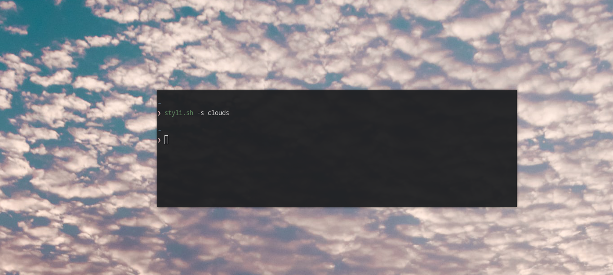

# Styli.sh - Wallpaper switching made easy


Styli.sh is a Bash script that aims to automate the tedious process of finding new wallpapers, downloading and switching them via the configs. **Styli.sh** can search for specific wallpapers from unsplash or download
a random image from the specified subreddits. If you have pywal it also can set automatically your terminal colors.



## Requirements

This script is made to work with ```feh```, ```nitrogen```, 
```XFCE```, ```GNOME```, ```KDE``` or  ```Sway```, having one of those is a requirement.```
## Install
```
git clone https://github.com/thevinter/styli.sh
cd styli.sh
./styli.sh
```

## Usage
```
# To set a random 1920x1080 background
$ ./styli.sh

# Save the current image to ~/Pictures directory
$ ./styli.sh -sa

# To specify a desired width or height
$ ./styli.sh -w 1080 -h 720
$ ./styli.sh -w 2560
$ ./styli.sh -h 1440

# To set a wallpaper based on a search term
$ ./styli.sh -s island
$ ./styli.sh -s "sea sunset"
$ ./styli.sh -s sea -w 1080

# To get a random wallpaper from one of the set subreddits
# NOTE: The width/height/search parameters DON'T work with reddit
$ ./styli.sh -l reddit

# To get a random wallpaper from a custom subreddit
$ ./styli.sh -r <custom_reddit>
$ ./styli.sh -r wallpaperdump

# To use the builtin feh --bg options
$ ./styli.sh -b <option>
$ ./styli.sh -b bg-scale -r widescreen-wallpaper

# To add custom feh flags
$ ./styli.sh -c <flags>
$ ./styli.sh -c --no-xinerama -r widescreen-wallpaper

# To automatically set the terminal colors
$ ./styli.sh -p

# To use nitrogen instead of feh
$ ./styli.sh -n

# To update > 1 screens using nitrogen
$ ./styli.sh -n -m <number_of_screens>

# Choose a random background from a directory
$ ./styli.sh -d /path/to/dir
```
## KDE, GNOME, XFCE & Sway
KDE, GNOME, XFCE and Sway are natively supported without the need of feh. The script currently does not allow to scale the image.
To use their built-in background managers use the appropriate flag.

```
# GNOME
$ ./styli.sh -g

# XFCE
$ ./styli.sh -x

# KDE
$ ./styli.sh -k

# Sway
$ ./styli.sh -y
```

## Tips And Tricks
To set a new background every time you reboot your computer add the following to your ```i3/config``` file (or any other WM config)
```
exec_always path/to/script/styli.sh
```

To change background every hour launch the following command
```
crontab -e
```
and add the following to the opened file
```
@hourly path/to/script/styli.sh
```

## Custom subreddits
To manage custom subreddits just edit the ```subreddits``` file by placing there all your desired communities, one for each newline

## TODO
* Cinnamon support
* Remove the need for flags by reading `$DESKTOP_SESSION`

## Plugins

(Proposed feature by @ppenguin)

Plugins are any functions defined in the subdir `./plugins/*.sh`, which will be sourced in `styli.sh`
and can then be called as "hook" functions.

The idea is that we can provide and easily integrate optional functionality, like e.g. postprocessing filters,
into `styli.sh`.

Currently includes one example, that provides:

- `overlay`: overlays an image (e.g. a logo from a given image) on the fetched wallpaper by invoking `imagemagick` on the fetched wallpaper,
  before supplying the image to the wallpaper set action.
  Inspired by [instantwallpaper](https://github.com/instantOS/instantWALLPAPER).

Another idea (next?) would be to define functions that could provide information instead of cli arguments, e.g. to query number of monitors and resolutions
if necessary (e.g. with `hyprctl monitors`). The return values of such functions should be well defined, so they could be implemented for multiple WMs/DEs with ease.
